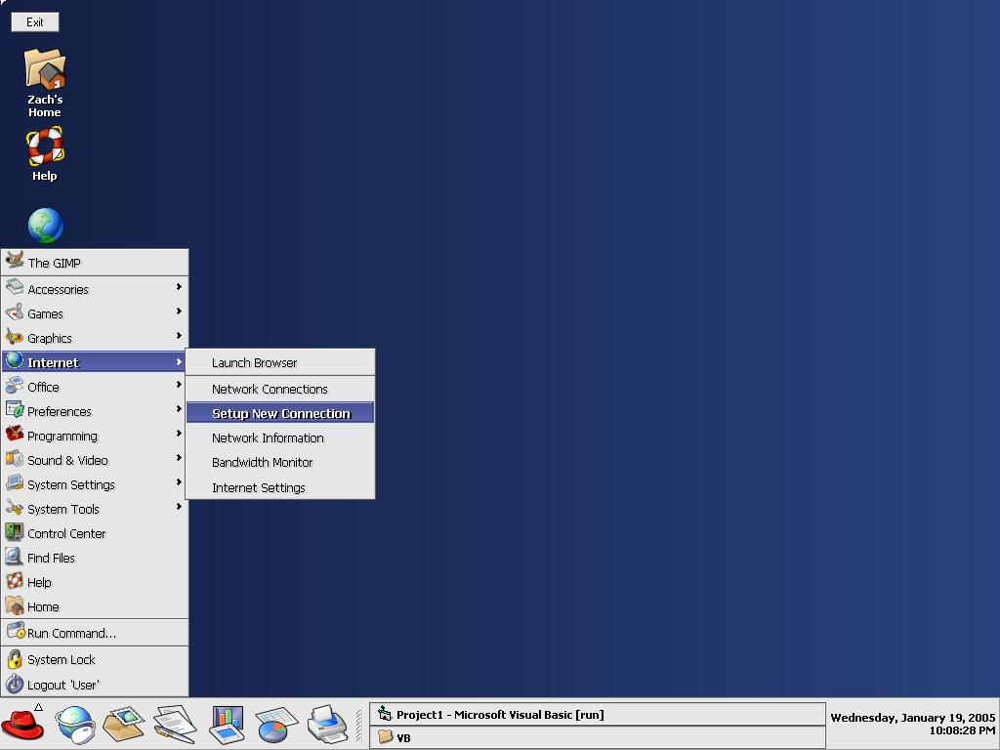



## RedHat Shell

### Description

This is a basic layout for a shell that looks like Linux RedHat. Comes with a few custom controls for easy customization. Has a 'startmenu', 'taskbar' as well has desktop icons. i was really bored and this is what i came up with. i didnt mean for this to have any use, just did it for fun.
 
### More Info
 

             |
---                |---
**Submitted On**   |2005-01-19 22:13:02
**By**             |[Eric Wolcott](https://github.com/Planet-Source-Code/PSCIndex/blob/master/ByAuthor/eric-wolcott.md)
**Level**          |Advanced
**User Rating**    |4.9 (93 globes from 19 users)
**Compatibility**  |VB 4\.0 \(32\-bit\), VB 5\.0, VB 6\.0
**Category**       |[Custom Controls/ Forms/  Menus](https://github.com/Planet-Source-Code/PSCIndex/blob/master/ByCategory/custom-controls-forms-menus__1-4.md)
**World**          |[Visual Basic](https://github.com/Planet-Source-Code/PSCIndex/blob/master/ByWorld/visual-basic.md)
**Archive File**   |[RedHat\_She1841961192005\.zip](https://github.com/Planet-Source-Code/eric-wolcott-redhat-shell__1-58380/archive/master.zip)

